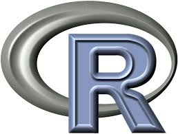

# R-Programming

# Overview of Repo
  - This repo contains scripts about R as a language ("native" R and use of R with packages). 
  - Each topic of R programming is broken up into a folder.
  
# Organization of Repo

  - RScripts: Contains programs I have written in R.
  - RReview: An overview of the R language.
  - DataMunging: Scripts I have written to handle data for munging/cleansing.

